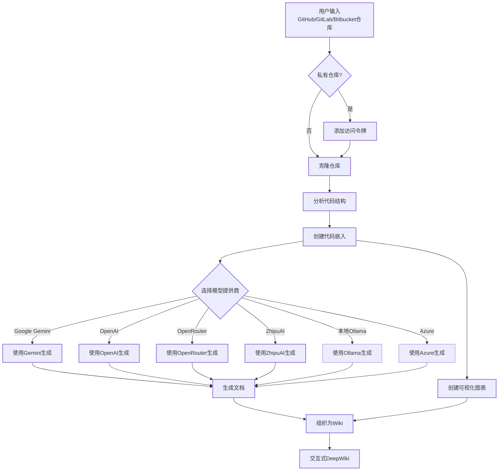
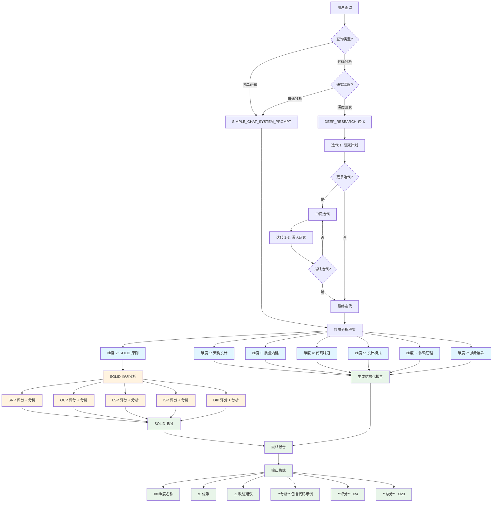

# DeepWiki-Open


**DeepWiki**可以为任何GitHub、GitLab或BitBucket代码仓库自动创建美观、交互式的Wiki！只需输入仓库名称，DeepWiki将：

1. 分析代码结构
2. 生成全面的文档
3. 创建可视化图表解释一切如何运作
4. 将所有内容整理成易于导航的Wiki

[](https://buymeacoffee.com/sheing)

[](https://x.com/sashimikun_void)
[](https://discord.com/invite/VQMBGR8u5v)

[English](./README.md) | [简体中文](./README.zh.md) | [繁體中文](./README.zh-tw.md) | [日本語](./README.ja.md) | [Español](./README.es.md) | [한국어](./README.kr.md) | [Tiếng Việt](./README.vi.md) | [Português Brasileiro](./README.pt-br.md) | [Français](./README.fr.md) | [Русский](./README.ru.md)

## ✨ 特点

- **即时文档**：几秒钟内将任何GitHub、GitLab或BitBucket仓库转换为Wiki
- **私有仓库支持**：使用个人访问令牌安全访问私有仓库
- **智能分析**：AI驱动的代码结构和关系理解
- **精美图表**：自动生成Mermaid图表可视化架构和数据流
- **简易导航**：简单、直观的界面探索Wiki
- **提问功能**：使用RAG驱动的AI与您的仓库聊天，获取准确答案
- **深度研究**：多轮研究过程，彻底调查复杂主题
- **多模型提供商**：支持Google Gemini、OpenAI、OpenRouter、ZhipuAI、Azure OpenAI和本地Ollama模型

## 🚀 快速开始（超级简单！）

### 选项1：使用Docker

```bash
# 克隆仓库
git clone https://github.com/AsyncFuncAI/deepwiki-open.git
cd deepwiki-open

# 创建包含API密钥的.env文件
echo "GOOGLE_API_KEY=your_google_api_key" > .env
echo "OPENAI_API_KEY=your_openai_api_key" >> .env
# 可选：如果您想使用OpenRouter模型，添加OpenRouter API密钥
echo "OPENROUTER_API_KEY=your_openrouter_api_key" >> .env

# 使用Docker Compose运行
docker-compose up
```

(上述 Docker 命令以及 `docker-compose.yml` 配置会挂载您主机上的 `~/.adalflow` 目录到容器内的 `/root/.adalflow`。此路径用于存储：
- 克隆的仓库 (`~/.adalflow/repos/`)
- 仓库的嵌入和索引 (`~/.adalflow/databases/`)
- 缓存的已生成 Wiki 内容 (`~/.adalflow/wikicache/`)

这确保了即使容器停止或移除，您的数据也能持久保存。)

> 💡 **获取这些密钥的地方：**
> - 从[Google AI Studio](https://makersuite.google.com/app/apikey)获取Google API密钥
> - 从[OpenAI Platform](https://platform.openai.com/api-keys)获取OpenAI API密钥

### 选项2：手动设置（推荐）

#### 步骤1：设置API密钥

在项目根目录创建一个`.env`文件，包含以下密钥：

```
GOOGLE_API_KEY=your_google_api_key
OPENAI_API_KEY=your_openai_api_key
# 可选：如果您想使用OpenRouter模型，添加此项
OPENROUTER_API_KEY=your_openrouter_api_key
# 可选：如果您想使用ZhipuAI模型，添加此项
ZHIPUAI_API_KEY=your_zhipuai_api_key
```

#### 步骤2：启动后端

```bash
# 安装Python依赖
python -m pip install poetry==2.0.1 && poetry install -C api

# 启动API服务器
python -m api.main
```

#### 步骤3：启动前端

```bash
# 安装JavaScript依赖
npm install
# 或
yarn install

# 启动Web应用
npm run dev
# 或
yarn dev
```

#### 步骤4：使用DeepWiki！

1. 在浏览器中打开[http://localhost:3000](http://localhost:3000)
2. 输入GitHub、GitLab或Bitbucket仓库（如`https://github.com/openai/codex`、`https://github.com/microsoft/autogen`、`https://gitlab.com/gitlab-org/gitlab`或`https://bitbucket.org/redradish/atlassian_app_versions`）
3. 对于私有仓库，点击"+ 添加访问令牌"并输入您的GitHub或GitLab个人访问令牌
4. 点击"生成Wiki"，见证奇迹的发生！

## 🔍 工作原理

DeepWiki使用AI来：

1. 克隆并分析GitHub、GitLab或Bitbucket仓库（包括使用令牌认证的私有仓库）
2. 创建代码嵌入用于智能检索
3. 使用上下文感知AI生成文档（使用Google Gemini、OpenAI、OpenRouter、ZhipuAI、Azure OpenAI或本地Ollama模型）
4. 创建可视化图表解释代码关系
5. 将所有内容组织成结构化Wiki
6. 通过提问功能实现与仓库的智能问答
7. 通过深度研究功能提供深入研究能力



## 🧠 代码分析与 SOLID 原则评估

DeepWiki 包含全面的代码分析功能，可自动评估 SOLID 原则：

### 分析维度

DeepWiki 从 **7 个关键维度** 分析代码：

1. **架构设计** - 设计模式、架构模式、关注点分离
2. **SOLID 原则** - 自动评分评估（每项 0-4 分，总分 0-20）
3. **质量内建** - 代码可读性、测试覆盖率、错误处理、安全性
4. **代码味道与重构** - 识别反模式并提供改进建议
5. **设计模式应用** - 评估模式使用并建议替代方案
6. **依赖管理** - 分析耦合度、循环依赖
7. **抽象层次** - 评估接口、封装、抽象层次

### SOLID 原则评分

每个 SOLID 原则按 **0-4 分** 评估：

- **4 分**：优秀实现，完全遵循原则
- **3 分**：良好实现，有轻微问题
- **2 分**：中等实现，存在一些违规
- **1 分**：差实现，存在重大违规
- **0 分**：未遵循该原则

**SOLID 总分**：所有 5 个原则的总和（0-20 分）

### 分析流程



### SOLID 分析输出示例

当分析代码时，DeepWiki 提供结构化反馈，如下所示：

```markdown
## SOLID 原则

### 单一职责原则 (SRP)
**评分**: 3/4
✅ **优势**: UserService 类职责清晰且聚焦
⚠️ **改进建议**: UserController 混合了日志记录与业务逻辑
**分析**: UserService 类设计良好，具有单一职责。但 UserController 违反了 SRP，因为它同时处理 HTTP 请求和日志记录关注点。

### 开闭原则 (OCP)
**评分**: 2/4
✅ **优势**: PaymentProcessor 接口允许扩展
⚠️ **改进建议**: 添加新支付类型需要修改现有的 switch 语句
**分析**: 虽然接口支持扩展，但实现使用的条件逻辑违反了 OCP。建议使用策略模式。

[... 继续分析 LSP、ISP、DIP ...]

**SOLID 总分**: 14/20
```

## 🛠️ 项目结构

```
deepwiki/
├── api/                  # 后端API服务器
│   ├── main.py           # API入口点
│   ├── api.py            # FastAPI实现
│   ├── rag.py            # 检索增强生成
│   ├── data_pipeline.py  # 数据处理工具
│   └── requirements.txt  # Python依赖
│
├── src/                  # 前端Next.js应用
│   ├── app/              # Next.js应用目录
│   │   └── page.tsx      # 主应用页面
│   └── components/       # React组件
│       └── Mermaid.tsx   # Mermaid图表渲染器
│
├── public/               # 静态资源
├── package.json          # JavaScript依赖
└── .env                  # 环境变量（需要创建）
```

## 🤖 提问和深度研究功能

### 提问功能

提问功能允许您使用检索增强生成（RAG）与您的仓库聊天：

- **上下文感知响应**：基于仓库中实际代码获取准确答案
- **RAG驱动**：系统检索相关代码片段，提供有根据的响应
- **实时流式传输**：实时查看生成的响应，获得更交互式的体验
- **对话历史**：系统在问题之间保持上下文，实现更连贯的交互

### 深度研究功能

深度研究通过多轮研究过程将仓库分析提升到新水平：

- **深入调查**：通过多次研究迭代彻底探索复杂主题
- **结构化过程**：遵循清晰的研究计划，包含更新和全面结论
- **自动继续**：AI自动继续研究直到达成结论（最多5次迭代）
- **研究阶段**：
  1. **研究计划**：概述方法和初步发现
  2. **研究更新**：在前一轮迭代基础上增加新见解
  3. **最终结论**：基于所有迭代提供全面答案

要使用深度研究，只需在提交问题前在提问界面中切换"深度研究"开关。

## 📱 截图


*DeepWiki的主界面*


*使用个人访问令牌访问私有仓库*


*深度研究为复杂主题进行多轮调查*

### 演示视频

[](https://youtu.be/zGANs8US8B4)

*观看DeepWiki实际操作！*

## ❓ 故障排除

### API密钥问题
- **"缺少环境变量"**：确保您的`.env`文件位于项目根目录并包含所需的API密钥
- **"API密钥无效"**：检查您是否正确复制了完整密钥，没有多余空格
- **"OpenRouter API错误"**：验证您的OpenRouter API密钥有效且有足够的额度

### 连接问题
- **"无法连接到API服务器"**：确保API服务器在端口8001上运行
- **"CORS错误"**：API配置为允许所有来源，但如果您遇到问题，请尝试在同一台机器上运行前端和后端

### 生成问题
- **"生成Wiki时出错"**：对于非常大的仓库，请先尝试较小的仓库
- **"无效的仓库格式"**：确保您使用有效的GitHub、GitLab或Bitbucket URL格式
- **"无法获取仓库结构"**：对于私有仓库，确保您输入了具有适当权限的有效个人访问令牌
- **"图表渲染错误"**：应用程序将自动尝试修复损坏的图表

### 常见解决方案
1. **重启两个服务器**：有时简单的重启可以解决大多数问题
2. **检查控制台日志**：打开浏览器开发者工具查看任何JavaScript错误
3. **检查API日志**：查看运行API的终端中的Python错误

## 🤝 贡献

欢迎贡献！随时：
- 为bug或功能请求开issue
- 提交pull request改进代码
- 分享您的反馈和想法

## 📄 许可证

本项目根据MIT许可证授权 - 详情请参阅[LICENSE](LICENSE)文件。

## ⭐ 星标历史

[](https://star-history.com/#AsyncFuncAI/deepwiki-open&Date)

## 🤖 基于提供者的模型选择系统

DeepWiki 现在实现了灵活的基于提供者的模型选择系统，支持多种 LLM 提供商：

### 支持的提供商和模型

- **Google**: 默认使用 `gemini-2.5-flash`，还支持 `gemini-2.5-flash-lite`、`gemini-2.5-pro` 等
- **OpenAI**: 默认使用 `gpt-5-nano`，还支持 `gpt-5`, `4o` 等
- **OpenRouter**: 通过统一 API 访问多种模型，包括 Claude、Llama、Mistral 等
- **ZhipuAI**: 默认使用 `glm-4-flash`，还支持 `glm-4-plus`、`glm-4-air` 等
- **Azure OpenAI**: 默认使用 `gpt-4o`，还支持 `o4-mini` 等
- **Ollama**: 支持本地运行的开源模型，如 `llama3`

### 环境变量

每个提供商需要相应的 API 密钥环境变量：

```
# API 密钥
GOOGLE_API_KEY=你的谷歌API密钥        # 使用 Google Gemini 模型必需
OPENAI_API_KEY=你的OpenAI密钥        # 使用 OpenAI 模型必需
OPENROUTER_API_KEY=你的OpenRouter密钥 # 使用 OpenRouter 模型必需
ZHIPUAI_API_KEY=你的ZhipuAI密钥      # 使用 ZhipuAI 模型必需

# 并发控制
ZHIPUAI_MAX_CONCURRENT=2             # ZhipuAI 最大并发请求数（默认：2）

# OpenAI API 基础 URL 配置
OPENAI_BASE_URL=https://自定义API端点.com/v1  # 可选，用于自定义 OpenAI API 端点
```

### 为服务提供者设计的自定义模型选择

自定义模型选择功能专为需要以下功能的服务提供者设计：

- 您可在您的组织内部为用户提供多种 AI 模型选择
- 您无需代码更改即可快速适应快速发展的 LLM 领域
- 您可支持预定义列表中没有的专业或微调模型

使用者可以通过从服务提供者预定义选项中选择或在前端界面中输入自定义模型标识符来实现其模型产品。

### 为企业私有渠道设计的基础 URL 配置

OpenAI 客户端的 base_url 配置主要为拥有私有 API 渠道的企业用户设计。此功能：

- 支持连接到私有或企业特定的 API 端点
- 允许组织使用自己的自托管或自定义部署的 LLM 服务
- 支持与第三方 OpenAI API 兼容服务的集成

**即将推出**：在未来的更新中，DeepWiki 将支持一种模式，用户需要在请求中提供自己的 API 密钥。这将允许拥有私有渠道的企业客户使用其现有的 API 安排，而不是与 DeepWiki 部署共享凭据。

### 环境变量

每个提供商需要其相应的API密钥环境变量：

```
# API密钥
GOOGLE_API_KEY=your_google_api_key        # Google Gemini模型必需
OPENAI_API_KEY=your_openai_api_key        # OpenAI模型必需
OPENROUTER_API_KEY=your_openrouter_api_key # OpenRouter模型必需

# OpenAI API基础URL配置
OPENAI_BASE_URL=https://custom-api-endpoint.com/v1  # 可选，用于自定义OpenAI API端点

# 配置目录
DEEPWIKI_CONFIG_DIR=/path/to/custom/config/dir  # 可选，用于自定义配置文件位置

# 授权模式
DEEPWIKI_AUTH_MODE=true  # 设置为 true 或 1 以启用授权模式
DEEPWIKI_AUTH_CODE=your_secret_code # 当 DEEPWIKI_AUTH_MODE 启用时所需的授权码
```
如果不使用ollama模式，那么需要配置OpenAI API密钥用于embeddings。其他密钥只有配置并使用使用对应提供商的模型时才需要。

## 授权模式

DeepWiki 可以配置为在授权模式下运行，在该模式下，生成 Wiki 需要有效的授权码。如果您想控制谁可以使用生成功能，这将非常有用。
限制使用前端页面生成wiki并保护已生成页面的缓存删除，但无法完全阻止直接访问 API 端点生成wiki。主要目的是为了保护管理员已生成的wiki页面，防止被访问者重新生成。

要启用授权模式，请设置以下环境变量：

- `DEEPWIKI_AUTH_MODE`: 将此设置为 `true` 或 `1`。启用后，前端将显示一个用于输入授权码的字段。
- `DEEPWIKI_AUTH_CODE`: 将此设置为所需的密钥。限制使用前端页面生成wiki并保护已生成页面的缓存删除，但无法完全阻止直接访问 API 端点生成wiki。

如果未设置 `DEEPWIKI_AUTH_MODE` 或将其设置为 `false`（或除 `true`/`1` 之外的任何其他值），则授权功能将被禁用，并且不需要任何代码。

### 配置文件

DeepWiki使用JSON配置文件管理系统的各个方面：

1. **`generator.json`**：文本生成模型配置
   - 定义可用的模型提供商（Google、OpenAI、OpenRouter、Ollama）
   - 指定每个提供商的默认和可用模型
   - 包含特定模型的参数，如temperature和top_p

2. **`embedder.json`**：嵌入模型和文本处理配置
   - 定义用于向量存储的嵌入模型
   - 包含用于RAG的检索器配置
   - 指定文档分块的文本分割器设置

3. **`repo.json`**：仓库处理配置
   - 包含排除特定文件和目录的文件过滤器
   - 定义仓库大小限制和处理规则

默认情况下，这些文件位于`api/config/`目录中。您可以使用`DEEPWIKI_CONFIG_DIR`环境变量自定义它们的位置。

### 面向服务提供商的自定义模型选择

自定义模型选择功能专为需要以下功能的服务提供者设计：

- 您可在您的组织内部为用户提供多种 AI 模型选择
- 您无需代码更改即可快速适应快速发展的 LLM 领域
- 您可支持预定义列表中没有的专业或微调模型

使用者可以通过从服务提供者预定义选项中选择或在前端界面中输入自定义模型标识符来实现其模型产品。

### 为企业私有渠道设计的基础 URL 配置

OpenAI 客户端的 base_url 配置主要为拥有私有 API 渠道的企业用户设计。此功能：

- 支持连接到私有或企业特定的 API 端点
- 允许组织使用自己的自托管或自定义部署的 LLM 服务
- 支持与第三方 OpenAI API 兼容服务的集成

**即将推出**：在未来的更新中，DeepWiki 将支持一种模式，用户需要在请求中提供自己的 API 密钥。这将允许拥有私有渠道的企业客户使用其现有的 API 安排，而不是与 DeepWiki 部署共享凭据。

## 🧩 使用 OpenAI 兼容的 Embedding 模型（如阿里巴巴 Qwen）

如果你希望使用 OpenAI 以外、但兼容 OpenAI 接口的 embedding 模型（如阿里巴巴 Qwen），请参考以下步骤：

1. 用 `api/config/embedder_openai_compatible.json` 的内容替换 `api/config/embedder.json`。
2. 在项目根目录的 `.env` 文件中，配置相应的环境变量，例如：
   ```
   OPENAI_API_KEY=你的_api_key
   OPENAI_BASE_URL=你的_openai_兼容接口地址
   ```
3. 程序会自动用环境变量的值替换 embedder.json 里的占位符。

这样即可无缝切换到 OpenAI 兼容的 embedding 服务，无需修改代码。

